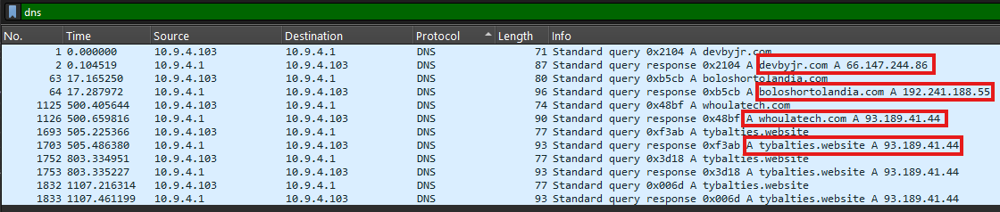

# DNS & HTTP Analysis
## DNS Analysis

**source** : Wireshark → Display Filter: dns

| Domain               | Type | Resolved IP    | Notes                                  |
| -------------------- | ---- | -------------- | -------------------------------------- |
| devbyjr.com          | A    | 66.147.244.86  |                                        |
| boloshortolandia.com | A    | 192.241.188.55 |                                        |
| whoulatech.com       | A    | 93.189.41.44   |                                        |
| tybalties.website    | A    | 93.189.41.44   | 3 resolutions observed for the same IP |

### Observation

- DNS activity is limited to four observed domains.
- Several resolved domains correlate with the main external communication endpoints identified during triage.
- tybalties.website resolved multiple times to the same IP address.

---

## HTTP Analysis

**source** : Wireshark → Display Filter: http

**Objective:**

Identify the large HTTP transfer observed during triage and determine its destination, content and relevance.

### HTTP Transactions 

| Source IP  | Destination IP  | Method | Host                 | URI                         | Notes                                                                                     |
| ---------- | --------------- | ------ | -------------------- | --------------------------- | ----------------------------------------------------------------------------------------- |
| 10.9.4.103 | 66.147.244.86   | GET    | devbyjr.com          | /Payments/                  | HTTP response contains attachment: Doc3134.doc                                            |
| 10.9.4.103 | 192.241.188.55  | GET    | boloshortolandia.com | /ozylgj6Z6/                 | HTTP response contains attachment: rFrUanXYL.exe                                          |
| 10.9.4.103 | 93.189.41.44    | GET    | tybalties.website    | /data2.php?AD94A3F72C8EDEE9 | Typical pattern of C2 communication                                                       |
| 10.9.4.103 | 201.146.211.106 | GET    | 201.146.211.106:7080 | /                           | Multiple HTTP responses with `text/html` content containing non-readable binary-like data |

**Doc3134.doc**

**rFrUanXYL.exe**

### Observations

- Multiple HTTP responses contain file attachments:
  - A `.doc` file was delivered from devbyjr.com.
  - An executable file (`.exe`) was delivered from boloshortolandia.com.

- The HTTP transactions correlate with the external IP addresses identified during triage.
- Multiple HTTP GET requests to `201.146.211.106:7080` were observed.
- HTTP responses were labeled as `text/html` but contained non-readable binary-like data.
- The content format could not be identified from the HTTP metadata alone.

---

## Communication Analysis

### 66.147.244.86

**source** : Filter: ip.addr == 66.147.244.86

| Property        | Value                                                          |
| --------------- | -------------------------------------------------------------- |
| Domain          | devbyjr.com                                                    |
| Protocols       | HTTP                                                           |
| Role            | HTTP file delivery                                             |
| Downloaded file | Doc3134.doc                                                    |
| Notes           | HTTP response contained a Composite Document File V2 Document. |

### 192.241.188.55

**source** : Filter: ip.addr == 192.241.188.55

| Property        | Value                                      |
| --------------- | ------------------------------------------ |
| Domain          | boloshortolandia.com                       |
| Protocols       | HTTP                                       |
| Role            | HTTP file delivery                         |
| Downloaded file | rFrUanXYL.exe                              |
| Notes           | HTTP response contained a PE32 executable. |

### 93.189.41.44

**source** : Filter: ip.addr == 93.189.41.44

| Property  | Value                                                                             |
| --------- | --------------------------------------------------------------------------------- |
| Domain    | whoulatech.com tybalties.website                                               |
| Protocols | HTTP / TLSv1 / WebSocket                                                          |
| SNI       | whoulatech.com                                                                    |
| Role      | Web communication endpoint                                                        |
| Notes     | Associated with whoulatech.com and tybalties.website. WebSocket traffic observed. |

### 201.146.211.106

**source** : Filter: ip.addr == 201.146.211.106

| Property  | Value                                                                                                                 |
| --------- | --------------------------------------------------------------------------------------------------------------------- |
| Domain    | None identified                                                                                                       |
| Protocols | HTTP                                                                                                                  |
| Port      | 7080                                                                                                                  |
| Role      | HTTP communication endpoint                                                                                           |
| Notes     | Multiple GET requests observed. Responses contained non-readable binary-like data despite being labeled as text/html. |
