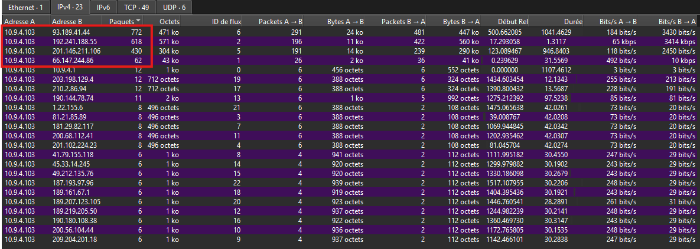

# Triage

## Capture Overview

**source** : capinfos

```powershell
& "C:\Program Files\Wireshark\capinfos.exe" 2018-09-04-Emotet-infection-with-IcedID.pcap
```

| Metric | Value |
|--------|-------|
| Duration | 1547.3 seconds (~25 min 47 sec) |
| Total Packets | 2,029 |
| Capture File Size | 1,438 kB |
| Earliest Packet (UTC) | 2018-09-04 22:56:55 |
| Latest Packet (UTC) | 2018-09-04 23:22:42 |

## Host Context

**source** : Statistics → Conversations → IPv4

Internal host: **10.9.4.103**

The capture contains traffic from a single internal endpoint communicating with multiple external hosts. This is consistent with a host-based capture rather than a network-wide capture.

## Protocol Hierarchy

**source** : Statistics → Protocol Hierarchy

| Protocol | Notes |
|----------|-------|
| TLS | Encrypted communications observed |
| HTTP | Multiple file transfers, including a 533,504-byte response |
| DNS | Queries resolving suspicious domains |
| WebSocket | WebSocket communications observed |

## Flagged for Deep Dive

| Item | Reason |
|------|--------|
| Large HTTP transfer | Identify transferred content and destination. |
| WebSocket traffic | Determine whether it is legitimate or part of the infection. |
| DNS activity | List all resolved domains and correlate them with subsequent communications. |

## Communication Overview

**source** : Statistics → Conversations → IPv4

| Destination IP  | Packets |  Bytes | Notes                                                                                             |
| --------------- | ------: | -----: | ------------------------------------------------------------------------------------------------- |
| 192.241.188.55  |     618 | 570571 | Highest data volume observed. Majority of traffic is server → client (559840 bytes).              |
| 93.189.41.44    |     772 | 470646 | Highest packet count observed. Majority of traffic is server → client (446593 bytes).             |
| 201.146.211.106 |     430 | 304069 | Significant communication volume observed. Majority of traffic is server → client (290072 bytes). |



## Initial Observations

- A single HTTP transfer accounts for a significant portion of the capture.
- DNS activity is very limited (12 queries).
- TLS traffic represents a large proportion of transferred bytes.
- WebSocket traffic is present.
- Three external IP addresses account for the majority of observed network activity.
- The largest transfers are mostly inbound (external host → 10.9.4.103).
- The top communication endpoints should be correlated with DNS, TLS and HTTP activity.

## DNS Analysis

**source** : Wireshark → Display Filter: dns

| Domain               | Type | Resolved IP    | Notes                                  |
| -------------------- | ---- | -------------- | -------------------------------------- |
| devbyjr.com          | A    | 66.147.244.86  |                                        |
| boloshortolandia.com | A    | 192.241.188.55 |                                        |
| whoulatech.com       | A    | 93.189.41.44   |                                        |
| tybalties.website    | A    | 93.189.41.44   | 3 resolutions observed for the same IP |


### Observation

- DNS activity is limited to four observed domains.
- Several resolved domains correlate with the main external communication endpoints identified during triage.
- tybalties.website resolved multiple times to the same IP address.
