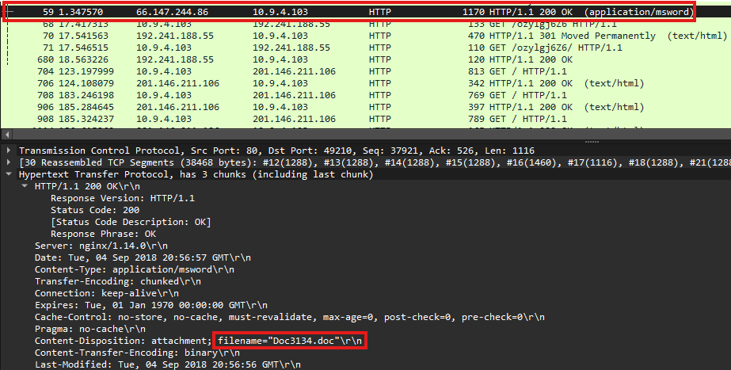
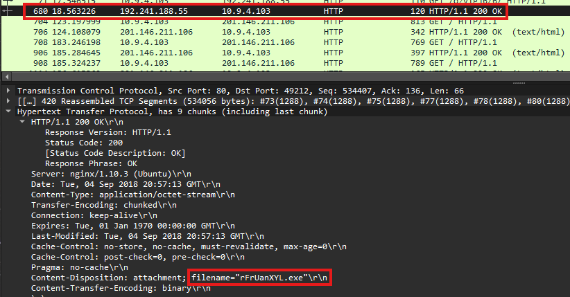
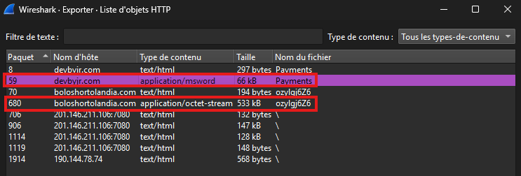

## HTTP Analysis

**source** : Wireshark → Display Filter: http

**Objective:**

Identify the large HTTP transfer observed during triage and determine its destination, content and relevance.

### HTTP Transactions 

| Source IP  | Destination IP  | Method | Host                 | URI                         | Notes                                                                                     |
| ---------- | --------------- | ------ | -------------------- | --------------------------- | ----------------------------------------------------------------------------------------- |
| 10.9.4.103 | 66.147.244.86   | GET    | devbyjr.com          | /Payments/                  | HTTP response contains attachment: Doc3134.doc                                            |
| 10.9.4.103 | 192.241.188.55  | GET    | boloshortolandia.com | /ozylgj6Z6/                 | HTTP response contains attachment: rFrUanXYL.exe                                          |
| 10.9.4.103 | 93.189.41.44    | GET    | tybalties.website    | /data2.php?AD94A3F72C8EDEE9 | HTTP communication observed                                                               |
| 10.9.4.103 | 201.146.211.106 | GET    | 201.146.211.106:7080 | /                           | Multiple HTTP responses with `text/html` content containing non-readable binary-like data |

**Doc3134.doc**



**rFrUanXYL.exe**



### Observations

- Multiple HTTP responses contain file attachments:
  - A `.doc` file was delivered from devbyjr.com.
  - An executable file (`.exe`) was delivered from boloshortolandia.com.




- The HTTP transactions correlate with the external IP addresses identified during triage.
- Multiple HTTP GET requests to `201.146.211.106:7080` were observed.
- HTTP responses were labeled as `text/html` but contained non-readable binary-like data.
- The content format could not be identified from the HTTP metadata alone.

---

## File Analysis

**source** : Wireshark → Export Objects → HTTP

**Objective:**

Analyze extracted files and collect additional indicators.

### Extracted Files

```powershell
Get-FileHash .\Payments -Algorithm SHA256
Get-FileHash .\ozylgj6Z6 -Algorithm SHA256
```

| File Name | SHA256                                                           |
| --------- | ---------------------------------------------------------------- |
| Payments  | FB984E86DD6A8018A58DFF37C13B3AA2B157025C6F11DE5249A101DA10CEEB90 |
| ozylgj6Z6 | 80BCA6CEC3F235547C36C5CF8DA9DFAE6A1F3C4DA71DEA4DCF40EAC342E293C3 |

```bash
file Payments
file ozylgj6Z6
```

| File Name | File Type                           | Reported Filename |
| --------- | ----------------------------------- | ----------------- |
| Payments  | Composite Document File V2 Document | Doc3134.doc       |
| ozylgj6Z6 | PE32 executable (GUI) Intel 80386   | rFrUanXYL.exe     |

### Observations

- Two files were successfully extracted from HTTP responses.
- One file is identified as a Microsoft Word document.
- One file is identified as a Windows PE32 executable.
- File hashes were collected for further reputation analysis.

## Communication Analysis

### 192.241.188.55

**source** : Filter: ip.addr == 192.241.188.55

| Property        | Value                                      |
| --------------- | ------------------------------------------ |
| Domain          | boloshortolandia.com                       |
| Protocols       | HTTP                                       |
| Role            | HTTP file delivery                         |
| Downloaded file | rFrUanXYL.exe                              |
| Notes           | HTTP response contained a PE32 executable. |

### 93.189.41.44

**source** : Filter: ip.addr == 93.189.41.44

| Property  | Value                                                                             |
| --------- | --------------------------------------------------------------------------------- |
| Domain    | whoulatech.com<br>tybalties.website                                               |
| Protocols | HTTP / TCP / TLSv1 / WebSocket                                                    |
| SNI       | whoulatech.com                                                                    |
| Role      | Web communication endpoint                                                        |
| Notes     | Associated with whoulatech.com and tybalties.website. WebSocket traffic observed. |

### 201.146.211.106

**source** : Filter: ip.addr == 201.146.211.106

| Property  | Value                                                                                                                 |
| --------- | --------------------------------------------------------------------------------------------------------------------- |
| Domain    | None identified                                                                                                       |
| Protocols | HTTP / TCP                                                                                                            |
| Port      | 7080                                                                                                                  |
| Role      | HTTP communication endpoint                                                                                           |
| Notes     | Multiple GET requests observed. Responses contained non-readable binary-like data despite being labeled as text/html. |
