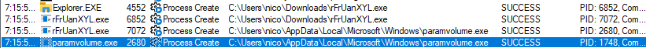
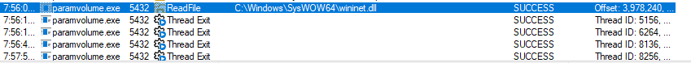
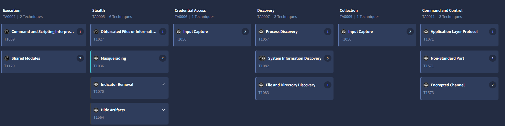
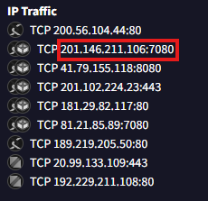

# rFrUanXYL.exe Dynamic Analysis

**Objective:** observe the file's actual behavior when executed.

## Setup

FLARE VM network adapter set to internal-only (no NAT, no bridge). 
FakeNet-NG simulates DNS/HTTP responses locally. Wireshark captures on 
both the network adapter and loopback.

## Process Behavior



`rFrUanXYL.exe` launches a copy of itself, `paramvolume.exe`, saved under `AppData\Local\Microsoft\Windows\`, then deletes itself. `paramvolume.exe` relaunches itself repeatedly, loads `wininet.dll` (the Windows network library), then its threads exit without any network connection attempt.



## paramvolume.exe hash

```powershell
Get-FileHash paramvolume.exe -Algorithm SHA256

80bca6cec3f235547c36c5cf8da9dfae6a1f3c4da71dea4dcf40eac342e293c3
``` 

Same SHA256 as `rFrUanXYL.exe`. `paramvolume.exe` is a direct copy, not a new downloaded or decrypted payload.

## Network Activity

No DNS or HTTP requests from `rFrUanXYL.exe` or `paramvolume.exe` were 
observed. Only legitimate Windows/Microsoft traffic was seen.

## External Correlation

VirusTotal sandbox analysis of the same file shows C2 behavior 
(Command and Control, Encrypted Channel), including a connection to 
`201.146.211.106:7080`.





This IP matches `201.146.211.106:7080` from the original pcap capture, 
where responses were labeled `text/html` but contained unreadable 
binary-like data.

## Conclusion

The malware executes its local behavior (self-copy, self-deletion, 
repeated relaunch) but never triggers network activity in this analysis 
environment. VirusTotal sandbox data confirms the file is capable of C2 
communication, matching an IP/port already seen in the original network 
capture.