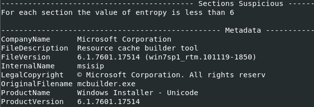
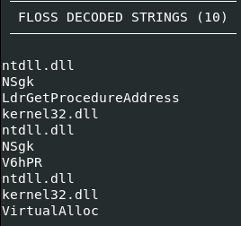

# rFrUanXYL.exe Static Analysis

**Objective:** identify the file's capabilities and behavior indicators 
without executing it.

## File Information

```bash
peframe rFrUanXYL.exe
```

| Property          | Value                                                            |
| ----------------- | ---------------------------------------------------------------- |
| Type              | PE32 executable (GUI), Intel 80386                               |
| Compile timestamp | 2018-09-04 19:30:28                                              |
| SHA256            | 80bca6cec3f235547c36c5cf8da9dfae6a1f3c4da71dea4dcf40eac342e293c3 |

Compile timestamp matches the pcap capture date (2018-09-04).

## Metadata

File metadata claims to be a legitimate Microsoft tool:

| Field | Value |
|---|---|
| CompanyName | Microsoft Corporation |
| FileDescription | Resource cache builder tool |
| OriginalFilename | mcbuilder.exe |



## Packing Check

All PE sections show entropy below 6 (packed files typically show 7 to 8). 
File is likely not packed.

## String Analysis

```bash
strings rFrUanXYL.exe
```

No URLs, IPs, or C2-related strings found in plain text, only standard 
Windows DLL imports (WININET.dll, ADVAPI32.dll, urlmon.dll, etc.).

## Dynamic API Resolution

```bash
floss rFrUanXYL.exe
```



FLOSS decoded strings not present in the normal import table. `VirtualAlloc` and `LdrGetProcedureAddress` are not listed in the import table shown by peframe. They only appear through FLOSS emulation.

### Conclusion

The file impersonates a legitimate Microsoft tool and is not packed. Static analysis alone does not explain why `VirtualAlloc` and `LdrGetProcedureAddress` are absent from the import table but present in FLOSS output. Dynamic analysis is needed to clarify this.