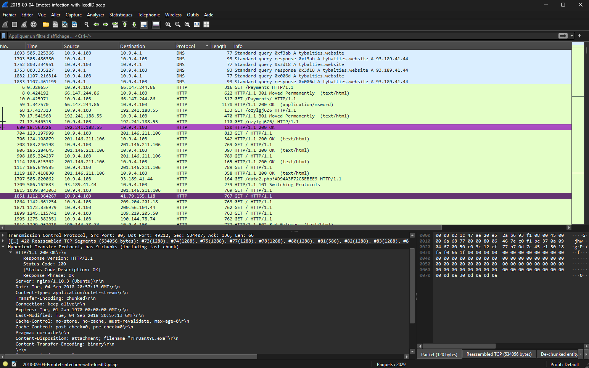

# PCAP Incident Investigation



## Overview

_Investigation based on a public malware dataset published by malware-traffic-analysis.net._

This project documents a full incident investigation, from network 
capture to malware analysis, on a PCAP related to an Emotet/IcedID 
infection chain.

The objective was to identify suspicious network activity, decode the 
infection mechanism through static and dynamic malware analysis, extract 
indicators of compromise (IOCs), enrich findings with threat intelligence, 
and create detection rules.

## Investigation Workflow

1. Case information and investigation scope
2. Network analysis:
   - Triage and traffic overview
   - DNS and HTTP analysis
   - File extraction
3. Malware analysis:
   - Static analysis of the malicious document (macro, obfuscation)
   - Static analysis of the executable (PE, metadata, strings)
   - Dynamic analysis (isolated sandbox execution)
4. Threat intelligence enrichment (IOCs, MITRE ATT&CK mapping)
5. Impact assessment
6. Final report and detection rules

## Key Findings

- `Doc3134.doc` delivers an obfuscated macro that auto-executes and drops 
  `rFrUanXYL.exe` via PowerShell
- `rFrUanXYL.exe` copies itself as `paramvolume.exe` and self-deletes 
  (anti-forensic behavior)
- Metadata impersonates a legitimate Microsoft tool (masquerading)
- C2 capability confirmed via external sandbox data, matching an IP/port 
  observed in the original capture
- Multiple IOCs identified: domains, IP addresses, file hashes

## Tools Used

- Wireshark, capinfos
- olevba (oletools), CyberChef
- peframe, FLOSS
- FLARE VM, FakeNet-NG, Process Monitor
- VirusTotal, Suricata

## Repository Structure

```
PCAP-Incident-Investigation/  
├── README.md  
│  
├── 01_CASE_INFORMATION/  
│ └── case_information.md  
│  
├── 02_NETWORK_ANALYSIS/  
│ ├── triage.md  
│ ├── dns_http_analysis.md  
│ └── extracted_files.md  
│  
├── 03_MALWARE_ANALYSIS/  
│ ├── doc3134_static_analysis.md  
│ ├── rFrUanXYL_static_analysis.md  
│ └── dynamic_analysis.md  
│  
├── 04_THREAT_INTEL/  
│ ├── IOC_table.md  
│ └── mitre_attack_mapping.md  
│  
├── 05_IMPACT_ASSESSMENT/  
│ └── impact_assessment.md  
│  
├── 06_FINAL_REPORT/  
│ ├── final_report.md  
│ └── detection_rules/  
│ └── suricata.md  
│  
└── screenshots/  
├── network/  
└── malware/
```

## Disclaimer

This investigation was conducted in an isolated lab environment for 
educational purposes. Dynamic analysis was performed in a network-isolated 
VM; no live C2 infrastructure was contacted.